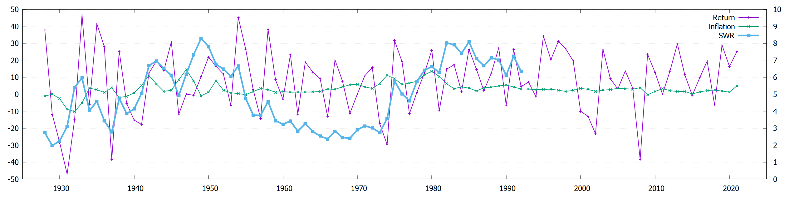

# invest-calc

What is the safe withdrawal rate (SWR)? 

Assuming you have E equity invested in the S&P 500 index fund and a withdrawal
rate of W when you start your retirement at year 0:  
To cover next year's expenses, you withdraw  
&emsp;E W  
The remaining equity at the end of year 0 is  
&emsp;e0 = E - E W  

If annual return for year 1 is r1, then at the end of year 1,
the equity becomes  
&emsp;e0 (1+r1)  
To adjust for year 1's inflation i1, now you withdraw  
&emsp;E W (1+i1)  
to cover next year's expenses. The remaining equity at the end of year 1 is  
&emsp;e1 = e0 (1+r1) - E W (1+i1)   

If annual return for year 2 is r2, then at the end of year 2,
the equity becomes  
&emsp;e1 (1+r2)  
After withdrawal for next year's expenses, the remaining equity at the end of
year 2 is  
&emsp;e2 = e1 (1+r2) - E W (1+i1) (1+i2)  
And so on.

In general, after withdrawal for next year's expenses, the remaining equity
at the end of year n is  
&emsp;en = en-1 (1+rn) - E W (1+i1) ... (1+in)  
&emsp;&emsp;= e0 (1+r1) ... (1+rn)  
&emsp;&emsp;&emsp;- E W (1+i1) (1+r2) ... (1+rn)  
&emsp;&emsp;&emsp;- ...  
&emsp;&emsp;&emsp;- E W (1+i1) ... (1+im) (1+rm+1) ... (1+rn)  
&emsp;&emsp;&emsp;- ...  
&emsp;&emsp;&emsp;- E W (1+i1) ... (1+in)  
&emsp;&emsp;= E [&emsp;&emsp;(1+r1) ... (1+rn)  
&emsp;&emsp;&emsp;&emsp;- W (1+r1) ... (1+rn)  
&emsp;&emsp;&emsp;&emsp;- W (1+i1) (1+r2) ... (1+rn)  
&emsp;&emsp;&emsp;&emsp;- ...  
&emsp;&emsp;&emsp;&emsp;- W (1+i1) ... (1+im) (1+rm+1) ... (1+rn)  
&emsp;&emsp;&emsp;&emsp;- ...  
&emsp;&emsp;&emsp;&emsp;- W (1+i1) ... (1+in)&emsp;]  

Safe withdrawal rate is the initial withdrawal rate to use such that at the
end of year n, the remaining equity runs out (i.e. en = 0). Since
the next year's expenses are already covered at this time, the initial equity
E actually lasted n+1 years. (note: the safe withdrawal rate does not really
depend on the initial equity amount E.)

&emsp;SWR = (1+r1) ... (1+rn) /  
&emsp;&emsp;&emsp;&emsp;[&emsp;&emsp;(1+r1) ... (1+rn)  
&emsp;&emsp;&emsp;&emsp;&emsp;+ (1+i1) (1+r2) ... (1+rn)  
&emsp;&emsp;&emsp;&emsp;&emsp;+ ...  
&emsp;&emsp;&emsp;&emsp;&emsp;+ (1+i1) ... (1+im) (1+rm+1) ... (1+rn)  
&emsp;&emsp;&emsp;&emsp;&emsp;+ ...  
&emsp;&emsp;&emsp;&emsp;&emsp;+ (1+i1) ... (1+in)&emsp;]  

SWR depends on how many years (i.e. n+1) the equity needs to last. It also
depends on the market performance (i.e. rm) and inflation (i.e.
im) in those years after the retirement, hence, which year the
retirement starts. Typically, the equity expected to last 30 years after
retirement. Using historical data, the following figure shows the SWR for
each starting year.

The inverse of SWR, let's call it safe equity withdrawal ratio (SEWR),
can be written like  
&emsp;SEWR = 1 / SWR  
&emsp;&emsp;&emsp;&emsp;= 1  
&emsp;&emsp;&emsp;&emsp;&emsp;+ (1+i1) / (1+r1)   
&emsp;&emsp;&emsp;&emsp;&emsp;+ ...  
&emsp;&emsp;&emsp;&emsp;&emsp;+ [(1+i1) ... (1+im)]  / [(1+r1) ... (1+rm)]  
&emsp;&emsp;&emsp;&emsp;&emsp;+ ...  
&emsp;&emsp;&emsp;&emsp;&emsp;+ [(1+i1) ... (1+in)]  / [(1+r1) ... (1+rn)]  
&emsp;&emsp;&emsp;&emsp;= 1  
&emsp;&emsp;&emsp;&emsp;&emsp;+ ci1 / cr1  
&emsp;&emsp;&emsp;&emsp;&emsp;+ ...  
&emsp;&emsp;&emsp;&emsp;&emsp;+ cim / crm  
&emsp;&emsp;&emsp;&emsp;&emsp;+ ...  
&emsp;&emsp;&emsp;&emsp;&emsp;+ cin / crn  

Above, cim is the compound inflation from year 1 to year m.
Similarly, crm is the compound return from year 1 to year m.

Specifically, if there is no change in inflation and return, or if the
inflation is identical to return every year, the safe equity withdrawal
ratio is  
&emsp;SEWRstatic = 1 + n  
For 30-year withdrawal, SEWRstatic is 30. This can serve as a
better indicator than the 4% rule (Initial equity should be 25 times the
initial withdrawal).

Only if you are optimistic and believe the compound inflations are always
lower than compound returns, the safe equity withdrawal ratio can be slightly
lower than SEWRstatic. If you are pessimistic, the safe
equity withdrawal ratio needs to be higher than SEWRstatic.

References

1. [Trinity study](https://en.wikipedia.org/wiki/Trinity_study)
2. [S&P 500 Annual Returns](https://www.macrotrends.net/2526/sp-500-historical-annual-returns)
3. [Annual Consumer Price Index](https://www.minneapolisfed.org/about-us/monetary-policy/inflation-calculator/consumer-price-index-1913-)
